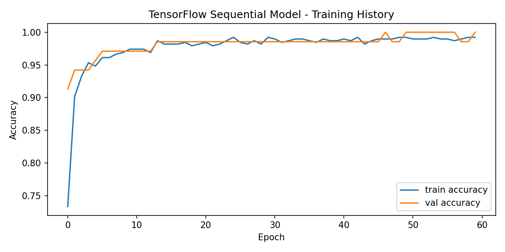
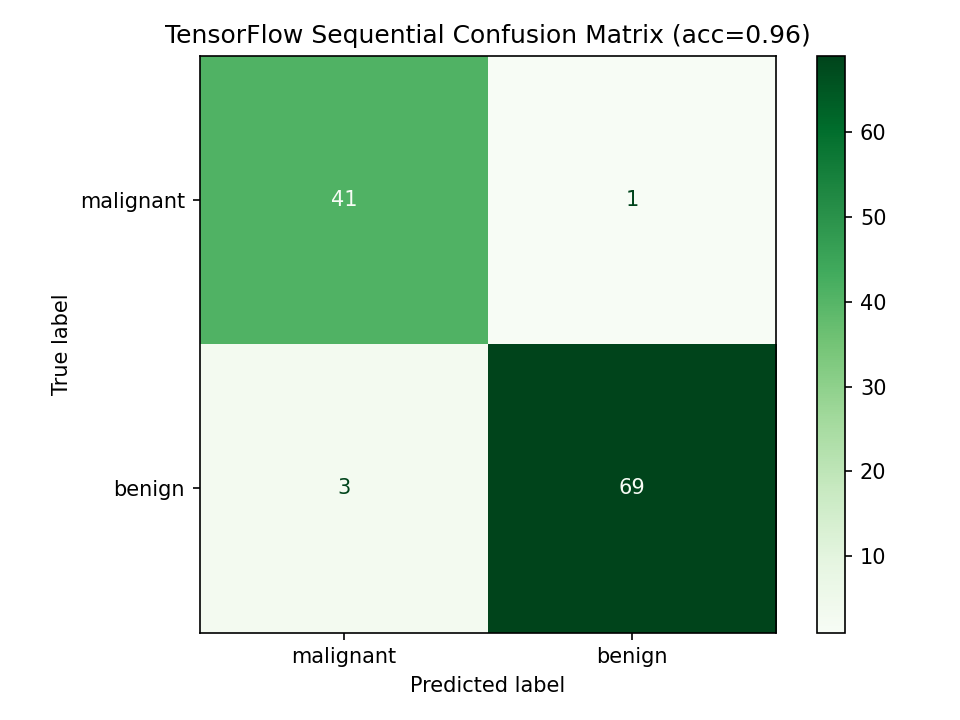

# 🧬 AI Breast Cancer Classification & Predictive Modeling
> **An end-to-end Machine Learning and Deep Learning pipeline for breast cancer diagnosis and comparative model evaluation.**

---

### 🌟 Project Overview
This project focuses on leveraging Artificial Intelligence to classify breast cancer cases into **Malignant** or **Benign** based on diagnostic clinical datasets. It provides a comprehensive comparative evaluation across standard Machine Learning classifiers and modern Deep Neural Networks implemented via **TensorFlow**.

---

### 🛠 Tech Stack & Tools

* **Core Languages:** Python (3.x), MATLAB (`.m`)
* **Deep Learning Framework:** TensorFlow / Keras
* **Machine Learning & Analytics:** Scikit-Learn, NumPy, Pandas, Matplotlib

---

### 🚀 Key Technical Features
* **📊 Multi-Framework Approach:** Features pipeline implementations in both Python (Scikit-Learn/TensorFlow) and MATLAB (`.m`) for mathematical verification.
* **🧠 Deep Learning Neural Network:** Custom-built Sequential Neural Network model in TensorFlow (`tensorflow_model_bc.py`) tailored for tabular medical data.
* **⚡ Preprocessed Data Splits:** Pre-partitioned train/test data stored efficiently in NumPy archive format (`bc_split.npz`) for reproducible benchmarking.
* **📈 Comprehensive Evaluation:** Automated script (`train_models_bc.py`) for training, hyperparameter tuning, and comparing classical ML algorithms.

---

## 📊 Model Performance & Results Comparison

| Model | Framework | Test Accuracy | Macro F1-Score | Key Takeaway |
| :--- | :--- | :---: | :---: | :--- |
| **Support Vector Classifier (SVC)** | Scikit-Learn | **98.25%** | **0.98** | Highest overall accuracy & precision; best margin separation on tabular features. |
| **Sequential Neural Network** | TensorFlow/Keras | **96.49%** | **0.96** | Strong performance with Dropout regularization to prevent overfitting. |
| **Decision Tree Classifier** | Scikit-Learn | **93.86%** | **0.93** | High interpretability, providing clear rule-based paths for clinical diagnosis. |

## 📈 Model Evaluation Plots

  
  

---

### 📂 Repository Structure

* 📁 **Presentation/** — Project slides and technical documentation
* 📄 **bc_split.npz** — Preprocessed NumPy binary splits (Train/Test)
* 📄 **breast_cancer_classification.m** — MATLAB numerical classification script
* 📄 **breast_cancer_dataset.csv** — Raw/Processed healthcare dataset
* 📄 **tensorflow_model_bc.py** — TensorFlow/Keras Neural Network architecture
* 📄 **train_models_bc.py** — Machine Learning training & evaluation script

---

### 👤 Author & Contact

**Youssef Alkamashany**

* 🚀 **Aspiring MLOps/LLMOps & AI Data Engineer.**
* 💼 **Team Leader — Microsoft Data Engineering | Digital Egypt Pioneers Initiative (DEPI).**

 

---

"Empowering Healthcare Diagnostics with Precision AI & Data Intelligence." 🧬💡 

